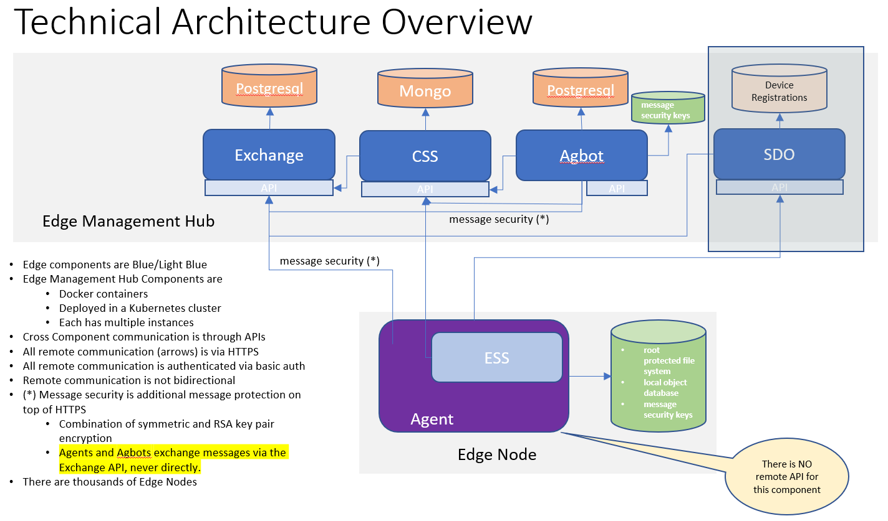

##架构总览

> “边缘编排体系结构中的一个常见主题是本地编排，它为运行在边缘的小型编排提供了足够的功能，
可以在从中央编排脱机时做出决策。 IBM开放给LF Edge开源的Open Horizon项目旨在通过新颖的分布式策略引擎将传统的云编排与边缘设备架起桥梁。
即使断开连接，此分布式策略引擎仍在执行并响应不断变化的条件。
采用“基础架构即代码”的思想为管理员提供了高度的配置和控制能力。”-Brad Corrion, active member of the Project EVE community and Strategic Architect at Intel

Open Horizon架构特点：
- 边缘原生-专为边缘设计，不是重新设计的云解决方案，不是重新设计的IoT解决方案
- 高安全性, 强健壮性，去中心化, 权限范围小
- 真正的 “zero-touch” 安装和管理
- 完全自主的代理(agent),由您设置的策略驱动
- 防火墙友好-设备节点只做pull操作，没有push操作
- 脱机时本地设备的agent仍可工作
- 分布式策略引擎-可方便升级，降级，回滚所部署的容器化软件
- 超大规模-每个管理中心可管理数万个节点
- 可管理kubernetes集群和/或独立Linux设备
- 单窗格，易于使用，基于角色的接口

此外，Open Horizon还有基础架构即代码，面向标准，针对容器化应用管理部署，且与厂商无关的特性。

###Open Horizon的几个概念:
简单理解**Open Horizon**就是通过制定的策略和管理中心(Management Hub)组件将容器化应用部署到设备为单位的节点。
- 管理中心 Management Hub: 专为边缘节点管理而设计，以最大程度地降低部署风险并完全自主地管理边缘节点上的服务软件生命周期。软件开发人员开发边缘服务并将其发布到管理中心。
其中包括以下组件(这里的组件Docker容器，可部署在Kubernetes集群中，且每个都有多个实例):
  - Agbot: 协议机器人（agreement robot）实例是集中创建的，负责将工作负载和机器学习模型部署到Open Horizon。
  - Exchange: 提供了REST API，其中包含Open Horizon中所有其他组件使用的所有定义（模式，策略，服务等）。
  - CSS (Cloud Sync Service）: 云同步服务, 负责将边缘服务所需的AI模型和其他文件部署到正确的边缘节点。
  - SDO (Secure Device Onboard)： 集成Intel的SDO项目实现“zero-touch”安全地将边缘设备连接到管理中心实例。
- 边缘节点（Edge Node）：单个边缘设备可以被看做是一个边缘节点。边缘节点可以是嵌入在硬件中的单个操作系统，嵌入在其他操作系统中的操作系统，或者是一个独立的虚拟机。所有边缘节点都需要安装Horizon Agent软件：
  - Agent：此软件安装在边缘节点上，以通过管理中心启用节点工作负载管理。
  - ESS (Edge Sync Service): 边缘节点中运行的边缘同步服务, CSS和ESS节点之间的通信可以通过MQTT或HTTP进行, 用于从CSS获取文件或资源如机器学习的模型(Machine learning models)。
- \*边缘集群(Edge Cluster): 在一些使用案例中需要边缘节点承载更多处理能力或者提供更多功能。
    可以将一组边缘节点服务器配置成边缘集群（可以借助K8S)。
